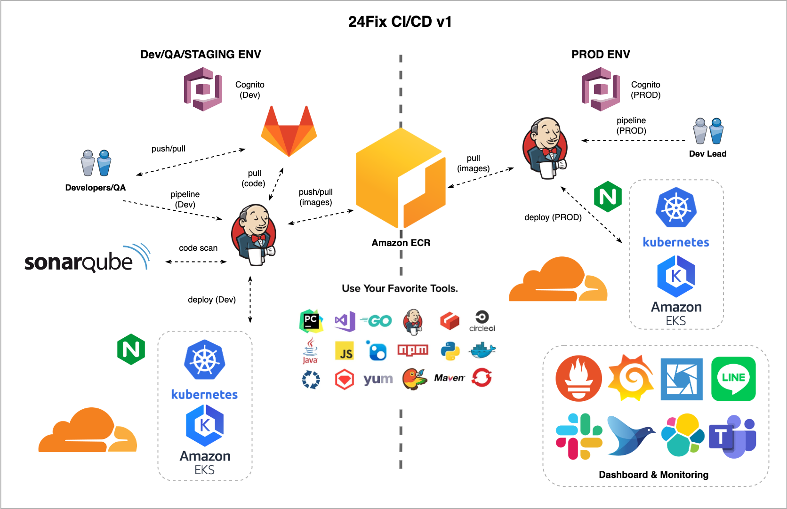

# Workshop Kubernetes (EKS) Demo App
GitHub/GitLab + Jenkins + k8s (EKS)

# 24Fix CI/CD v1 Overview


# Agenda
- Overview k8s 
- What's k8s? ระบบจัดการ container platform
  - Open source container orchestration tool
  - Developed by Google
  - Help you manage containerized applications in different deployment ENV
- Why k8s? ทำให้การทำงาน ง่ายขึ้น ระบบ automate ได้ง่ายขึ้น flexible ขึ้น
- Who use k8s?
https://kubernetes.io/case-studies/

# Viewing Pods and Nodes
https://kubernetes.io/docs/tutorials/kubernetes-basics/explore/explore-intro/

# Workshop 1
- Install & Config kubectl client (CLI)
https://aws.amazon.com/premiumsupport/knowledge-center/eks-cluster-kubernetes-dashboard/

- ถ้า Install kubectl ไม่ได้
ssh -i 24slg-nonprod.pem ubuntu@52.221.203.86

- kubectl get all, ns, deployment, pod, service

- kubectl create ns
- kubectl create deployment
- kubectl expose deployment
- kubectl scale deployment
- kubectl delete service
- kubectl delete deployment
- kubectl delete ns

- Lens k8s Dashboard & Monitoring
kubectl config view --minify --raw

- Deploy k8s App with Jenkins Pipeline
- Deploy k8s App in Dev ENV (build, tag, push, pull images)
- Deploy k8s App in QA ENV (from images tag)
- Auto Deploy from GitHub/GitLab Trigger to Jenkins

Options (ถ้าเวลาเหลือ)
- k8s secret, configmaps
- k8s pv, pvc
- Grafana + Prometheus k8s Dashboard & Monitoring

# Update kubeconfig EKS Dev
1.Install aws cli
https://docs.aws.amazon.com/cli/latest/userguide/getting-started-install.html

2.Install kubectl
https://kubernetes.io/docs/tasks/tools/

3.Insert aws credentials to ~/.aws/credentials
```
[24slg-nonprod]
aws_access_key_id=xxx
aws_secret_access_key=xxx
```

4.Update kubeconfig (~/.kube/config) with aws cli
```
aws eks update-kubeconfig --name 24slg-nonprod \
--region ap-southeast-1 \
--profile 24slg-nonprod
```

5.Install Lens (Options)
https://k8slens.dev/

6.Test 
```
kubectl get node
```
- Open Lens add 24slg-nonprod cluster

# Labs
```
# Show Cluster Info
kubectl cluster-info

# Show Namespace
kubectl get ns

# Show Deployment
kubectl get deployments -n dev

# Create Deployment
kubectl create deployment yourname-web --image=nginx -n dev

# Port Forward
kubectl port-forward yourname-web-xxx 8080:80 -n dev

# Show Logs
kubectl logs -f yourname-web-xxx -n dev

# Expose Service
kubectl expose deployment yourname-web -n dev --port=80 --target-port=80

# Create Ingress
cat <<EOF | kubectl apply -f -
apiVersion: extensions/v1beta1
kind: Ingress
metadata:
  name: yourname-web
  namespace: dev
  annotations:
    kubernetes.io/ingress.class: nginx
spec:
  rules:
    - host: yourname-web.24fix.tech
      http:
        paths:
          - backend:
              serviceName: yourname-web
              servicePort: 80
EOF

# Scale App
kubectl scale deployment/yourname-web --replicas=2 -n dev

# Delete Ingress
kubectl delete ingress yourname-web -n dev

# Delete Service
kubectl delete service yourname-web -n dev

# Delete Deployment
kubectl delete deployment yourname-web -n dev
```

# Workshop 2
## [GitLab]
1. Create your repository https://gitlab.com/24fix/workshop/[name-app]
2. Copy file from https://gitlab.com/24fix/demo-app-k8s to your repository
3. Edit Jenkinsfile-APM 
- APP_GIT_URL = "https://gitlab.com/24fix/workshop/[name-app]"
- APP_BRANCH = "main"
- APP_NAME = "[name-app]"
- DEV_PROJECT = "workshop"
- ECR_SERVER = "470797444311.dkr.ecr.ap-southeast-1.amazonaws.com/workshop"

## [Jenkins]
https://cicd.24fix.tech/

4. Create username-password (name)
5. Create Job under folder workshop with name DEV-[name-app]

## [ECR]
6. Create docker repository workshop/[name-app]

## [Lens]
7. Create secret [name-app] with credentials
- ELASTIC_APM_SERVICE_NAME = "[name-app]-workshop"
- ELASTIC_APM_SECRET_TOKEN = "hXCQ7ROHsbJOwjcx2p"
- ELASTIC_APM_SERVER_URL = "https://79b7978d46434d1287b4bdde2c9c3f85.apm.us-central1.gcp.cloud.es.io:443" 

## [CloudFlare]
8. Create subdomain [name-app]-workshop.24fix.tech

# Jenkins
https://cicd.24fix.tech/
- u: -
- p: -

# Grafana Dashboard
https://grafana.24fix.tech/
- u: -
- p: -

# ELK Stack
https://fix-nonprod.kb.us-central1.gcp.cloud.es.io:9243/app/home
- u: -
- p: -

### Ref:
- Kubernetes Tutorial for Beginners [FULL COURSE in 4 Hours] https://www.youtube.com/watch?v=X48VuDVv0do
- DO280
https://www.redhat.com/en/services/training/do280-red-hat-openshift-administration-II-operating-production-kubernetes-cluster
- DO288
https://www.redhat.com/en/services/training/do288-red-hat-openshift-development-ii-containerizing-applications
